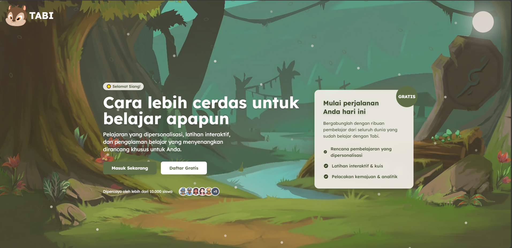

<h1>Tabi (Tangan Bicara) ✋</h1>

<p align="center">
  
</p>
 
<p align="center">Main Page.</p>

## 📖 Tentang Tabi

Tabi (Tangan Bicara) is an Indonesian sign language (bisindo) learning platform designed to help everyone learn sign language in an interactive and fun way. The platform aims to bridge the communication gap between the deaf and hearing communities, and promote inclusion and accessibility for all.

## 💎 Fitur Utama (Beta)

- Interactive Learning: interactive exercises for learning sign language
- Visual Dictionary: A collection of words and phrases in sign language with illustrations
- Daily Challenges: Daily short exercises to maintain learning consistency
 
## Installation For Window/RDP

```bash
npm i
npm start
```

## License

This project is under the [?](https://github.com/Zhvny)

## Helper 🤖

Just DM me with instagram [?](https://www.instagram.com/jkt48.kathrina/)
